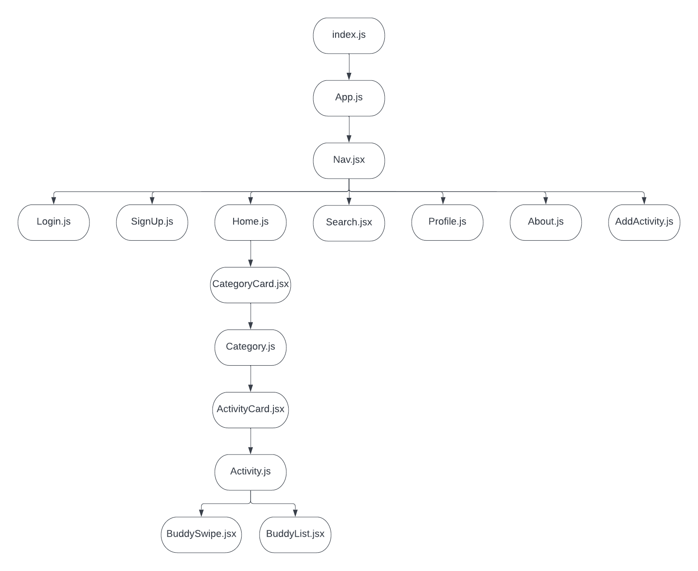

# BuddyUp Frontend

## Date: 11/10/22

### By: Kalen Luciano, Shondriane Mesa-Wise, and Aekangi Patel

### Kalen Luciano: [Github](https://github.com/kalenluciano) | [Linkedin](https://www.linkedin.com/in/kalenluciano/)

### Aekangi Patel: [Github](https://github.com/Aekangi) | [Linkedin](https://www.linkedin.com/in/aekangipatel/)

### Shondriane Mesa-Wise: [Github](https://github.com/shondriane) | [LinkedIn](https://www.linkedin.com/in/shondriane-mesa-wise/)

---

### **_Description_**

BuddyUp is specially tailored for those individuals that want to go to certain activities/events, but don't wish to go alone. Through the app, the user is able to scroll through different user profiles, and match with users that are interested in attending the same event.

### **_Technologies Used_**

- JavaScript
- React.js
- Sequelize
- PostgreSQL
- Node.js
- CSS

**_Component Hierarchy Diagram:_**

---

### **_Getting Started_**

<<<<<<< HEAD
1. Fork and clone
2. npm install
3. npm start

A trello board used to keep track of development progress can be [viewed here](https://trello.com/b/y27ScqGm/buddy-up).

The project itself was deployed and can be [viewed here](https://buddy-match-up.herokuapp.com/).
=======
### ***Getting Started***
1. `Fork` and `clone`
2. Run `npm install`
3. Run `npm start`

A trello board used to keep track of development progress can be [viewed here](https://trello.com/b/y27ScqGm/buddy-up)

The project itself was deployed and can be [viewed here](https://buddy-match-up.herokuapp.com)
>>>>>>> 03bc5893b292c025e5d8323e931c411be3ddb90a

---

### **_Screenshots_**

---

### **_Future Features_**

- Ability to upload profile photo from the users device
- Add a Page that displays all activities around the world.
- Improve search functionality
- Add a tab to search all activities by individual cities
- Refactor variable names
