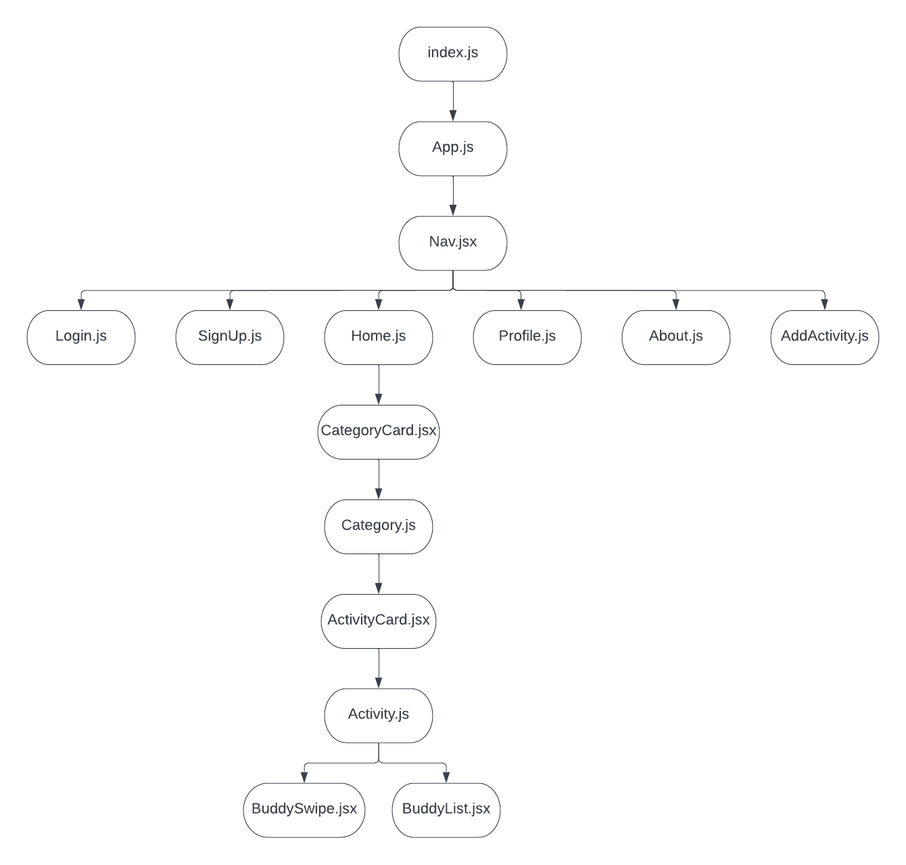

# BuddyUp Frontend
## Date: 11/10/22
### By: Kalen Luciano, Shondriane Mesa-Wise, and Aekangi Patel
### Kalen Luciano: [Github](https://github.com/kalenluciano) | [Linkedin](https://www.linkedin.com/in/kalenluciano/)
### Aekangi Patel: [Github](https://github.com/Aekangi) | [Linkedin](https://www.linkedin.com/in/aekangipatel/)
### Shondriane Mesa-Wise: [Github](https://github.com/shondriane) | [LinkedIn](https://www.linkedin.com/in/shondriane-mesa-wise/)

***

### ***Description***
BuddyUp allows you to select an activity and match with a buddy of your choice. 

***

### ***Technologies Used***
* HTML
* CSS
* React.js
* JavaScript

**_Component Hierarchy Diagram:_**

***

### ***Getting Started***
1. `Fork` and `clone`
2. Run `npm install`
3. Run `npm start`

A trello board used to keep track of development progress can be [viewed here](https://trello.com/b/y27ScqGm/buddy-up)

The project itself was deployed and can be [viewed here](https://buddy-match-up.herokuapp.com)

***

### ***Screenshots***

***
### ***Credits***
